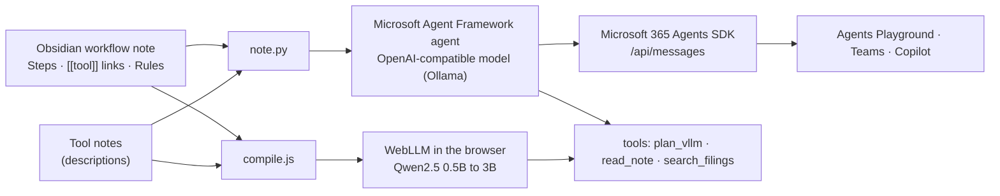

# Workflow Copilot

Write an agent's workflow as an Obsidian note; get a chatbot. The note holds the agent's goal, steps, tools and
rules in plain markdown. Workflow Copilot compiles it into an agent and runs it two ways:

- **Microsoft stack:** a [Microsoft Agent Framework](https://github.com/microsoft/agent-framework) agent served
  through the **Microsoft 365 Agents SDK** (the endpoint Microsoft 365 Agents Playground, Teams and Copilot talk to),
  on any OpenAI-compatible model: Ollama locally, vLLM, or Azure OpenAI.
- **In the browser:** the same note compiled by `web/compile.js` and run with a small open model on the visitor's
  GPU through [WebLLM](https://github.com/mlc-ai/web-llm). No server, no API key.

**Demo:** [howardguoui.github.io/workflow-copilot](https://howardguoui.github.io/workflow-copilot/): edit a workflow
note and watch the agent recompile, chat with it in the browser, and read transcripts recorded with the full Python
runtime and Qwen3 8B.

**Stack:** Python, Microsoft Agent Framework, Microsoft 365 Agents SDK (aiohttp), Ollama, WebLLM (WebGPU), JavaScript,
pytest, GitHub Actions



## A workflow note

```markdown
---
type: workflow
name: GPU Sizing Assistant
description: Answers "will this model fit on my GPU, and for how many users?" for vLLM deployments.
---
## Steps
1. Find the model, GPU memory, weights size and context length in the question. Assume FP16 KV cache.
2. Call [[plan_vllm]] with those values.
3. If the result says `fits: false`, call [[plan_vllm]] again with `kv_cache_dtype: fp8` before answering.
   Never work out FP8 numbers yourself.
4. If the user asks which server to run, read [[vLLM vs llama.cpp vs Ollama]] and quote its numbers.

## Tools
- [[plan_vllm]]
- [[read_note]]

## Rules
- Never invent benchmark numbers: only quote tool results and the notes you read.
```

Compiling it gives the agent its system instructions, exactly the tools linked under `## Tools` (described by the
tool notes in `vault/Tools/`), and read access to the other notes it links to, nothing else.
`workflow-copilot compile "vault/GPU Sizing Assistant.md"` prints the result.

The tools use real data: `plan_vllm` is the vLLM planner from
[Local Inference Lab](https://github.com/howardguoui/local-inference-lab) (its benchmark notes quote measured
results), and `search_filings` returns answers recorded from [Filings RAG](https://github.com/howardguoui/filings-rag).

## Run it

```bash
python -m venv .venv && .venv/bin/pip install -e ".[dev]"
ollama pull qwen3:8b
workflow-copilot chat  "vault/GPU Sizing Assistant.md"      # terminal chat; tool calls are printed
workflow-copilot serve "vault/GPU Sizing Assistant.md"      # Microsoft 365 Agents SDK endpoint on :3978
workflow-copilot record vault                                # answer every note's examples -> docs/transcripts.json
workflow-copilot site                                        # build the static demo into docs/
```

`--base-url` and `--model` (or `COPILOT_BASE_URL`, `COPILOT_MODEL`) point it at any OpenAI-compatible server.

**Microsoft 365:** `serve` runs anonymously for local use, which is what Microsoft 365 Agents Playground expects;
point Playground at `http://localhost:3978/api/messages`. To reach Teams or Microsoft 365 Copilot, register an Azure
Bot and swap the anonymous connection in `m365.py` for an MSAL connection manager
(`microsoft-agents-authentication-msal`); that part needs an Azure subscription and is not exercised here.

## The browser bot

`docs/` is a static page (GitHub Pages). It loads the vault's markdown, compiles the selected note with `compile.js`
and runs a Qwen2.5 model with WebLLM. Small models are unreliable at free-form tool calling, so each turn is split:
the model picks the next tool from the note's list (output constrained to a JSON schema), fills that tool's arguments
(also schema-constrained), the tool runs in the page, and the model writes the answer from the result. Browsers
without WebGPU (most phones) get the recorded transcripts instead.

## Tests

```bash
.venv/bin/ruff check . && .venv/bin/ruff format --check .
.venv/bin/pytest -q
```

- the parser and compiler on the vault notes; the tools against Local Inference Lab's numbers;
- the Agent Framework agent against a scripted OpenAI-compatible server: the note becomes the system prompt, only
  linked tools are offered, the tool call runs and its result reaches the model;
- the Microsoft 365 Agents SDK endpoint end to end: a Bot Framework activity in, the agent's reply out
  (`deliveryMode: expectReplies`);
- `web/compile.js` and `web/tools.js` under Node against the Python versions (same JSON for every note, same tool
  results on a grid of inputs).

`scripts/check_page.js` drives the built page in headless Chromium with a stand-in model to check the browser agent
loop (needs Playwright).

## Layout

```
vault/                     Obsidian vault: workflow notes, Tools/, Notes/
src/workflow_copilot/      note.py (compiler), tools.py, agent.py (Agent Framework), m365.py (Agents SDK), cli.py, site.py
web/                       index.html, app.js (WebLLM), compile.js, tools.js, planner.js
docs/                      built demo for GitHub Pages
tests/                     pytest
```
